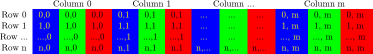
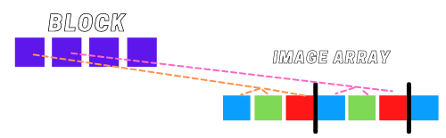

# IMAGE COMPARISON WITH CUDA

## Introduction
This is a program that compares two images in two modes: Hard (pixel by pixel) and overall silhouette.
It uses *Parallel Programming* (CUDA) in order to enhace performance. It works perfectly for small and large images. 

## Parallel Programming


## Boosting up my code with CUDA
### Linearizing my matrix
According to OpenCV Docs, images are stored in a container called _Mat_ which is basically a Matrix. The size of the matrix depends of the color system used. More accurately, it depends from the number of channels used. In case of a gray scale (2 channels) image we have something like: [1]


Figure 1: Matrix for grayscale Image

On the other hand for color images like PNG format (3 channels) (which is the one we are using on the project) it will be something like:



Figure 2: Matrix for Colored Image


Because in many cases the memory is large enough to store the rows in a successive way the rows may follow one after another, creating a single long row. Because everything is in a single place following one after another this may help to speed up the scanning process. We can use the isContinuous() function to ask the matrix if this is the case. It will almost always be a positive answer, only in cases where de image is extremely long, it may be a non successive row.

Knowing this, it's easy to determine the way we are going to access the matrix with a linearized index. As we know the _basic_ formula for a n(rows) by m(columns) matrix is always: 

``` cpp
int main(){

    int index = i * m + j;
}
```
Where _i_ is be the variable which will be used to reffer to the rows of the original matrix and _j_ will be the one used to go through the columns. 

So, back to this project. As I wanted to make sure that each thread is in charge to check each pixel. I will use several 1 dim blocks with several threads each (512) to be sure I have enough threads for any image. The way I'm getting the blocks is: _Imagewidth * ImageHeight / 512_. By doing it this way I will not have unnecessary unused blocks 
And for getting the indexes of the image array that each thread will work with I'm using the next formula: 

``` cpp
int main(){

    int id = (threadIdx.x + blockIdx.x * blockDim.x) * channels;
}
```

Where _threadIdx.x_ will be de *x index of the thread* within the block. 
blockIdx.x is the *x index of the block* within the "grid" made of blocks.
blockDim.x is the *size per block* 
And then I will iterate over the channels with a for loop. 

So a visual representation for a colored image of what each thread will be doing is more or less like this:


Figure 3: Representation of threads and image array

### Hard comparison
This is actually the simplest comparison to do. 


### Silhouette comparison


## Use cases

### FIA's avoiding

### Enterteinment

## How to Run the Application

## References 